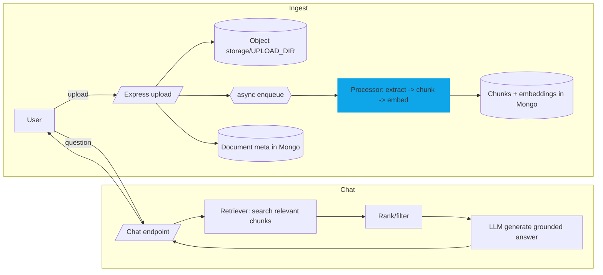

# Document Intelligence Platform (RAG system)

Upload PDFs/DOCX/PPTX, chunk + index them, then chat with grounded answers. Stack: Next.js 14 + Tailwind (TS) frontend, Express + MongoDB (TS) backend, JWT auth, multi-user isolation, local embeddings via `@xenova/transformers` (Xenova/all-MiniLM-L6-v2), and LLM responses via Groq (Llama 3.1 8B instant). No paid OpenAI/HF inference required.

## Project structure
- `frontend/` Next.js (app router) + Tailwind UI (auth, uploads, chat).
- `backend/` Express API, JWT auth, Mongo models, upload + processing queue, retrieval endpoints.

## Run locally
```bash
cd backend && cp .env.example .env && npm install && npm run dev
# in another shell
cd frontend && cp .env.example .env.local && npm install && npm run dev
```
Backend at `http://localhost:4000`, frontend at `http://localhost:3000`.

Routes (frontend):
- `/auth/login` — login
- `/auth/register` — signup
- `/dashboard` — upload/list/delete docs
- `/chat` — chat with retrieval, scope filter, reset chat
- `/` — redirects to login or dashboard based on token

## Deployment (Vercel + separate Node host)
- Frontend: Vercel (set `NEXT_PUBLIC_API_BASE` to your backend URL in Vercel env).
- Backend: any Node host (Render/Fly/Railway/Vercel serverless) with outbound HTTPS allowed. Env vars:
  - `MONGO_URL`, `JWT_SECRET`, `CORS_ORIGIN`, `UPLOAD_DIR`
  - `LLM_PROVIDER=groq`
  - `LLM_MODEL=llama-3.1-8b-instant` (or your Groq model)
  - `GROQ_API_KEY`
  - `LOG_LEVEL` (optional)

## High-level architecture


## API surface (backend)
- `POST /api/auth/register|login` — JWT issuance.
- `POST /api/docs/upload` — upload single file; enqueues processing.
- `GET /api/docs` — list user documents.
- `DELETE /api/docs/:id` — delete document.
- `GET /api/chat/history` — last 100 messages.
- `POST /api/chat/ask` — retrieval + answer with citations.

## Retrieval pipeline (current)
1) Extract text (pdf-parse / text read)  
2) Chunk (~500 tokens) with cleanup of non-printable chars  
3) Embed chunks locally via `@xenova/transformers` (Xenova/all-MiniLM-L6-v2)  
4) Store chunks + vectors in Mongo  
5) Query embedding (same model) → cosine scoring with fallback  
6) LLM answer via Groq (Llama 3.1 8B instant) grounded on top hits; if LLM unavailable, fall back to extractive snippets.

## Advanced features
- Smart per-user isolation (userId filter on docs, chunks, chat, retrieval)
- Scope filter in chat (choose a specific document)
- Chat reset per user

## Design decisions
- **TypeScript everywhere** for consistency.
- **Local embeddings** via Xenova to avoid paid API limits; HF token only for model download.
- **Background processing** via `process.nextTick` placeholder to keep uploads non-blocking; replace with worker/queue (BullMQ/SQS) in prod.
- **Mongo-backed chunks** for simple local dev; can be swapped for vector DB.
- **Tailwind** for fast UI theming; glassmorphism accents for clarity.

## Known gaps (to finish before prod)
- Add rate limiting + better file size/type validation.
- Add OCR for scanned PDFs.
- Add highlighted source snippets in UI.
- Add tests (API + UI).
